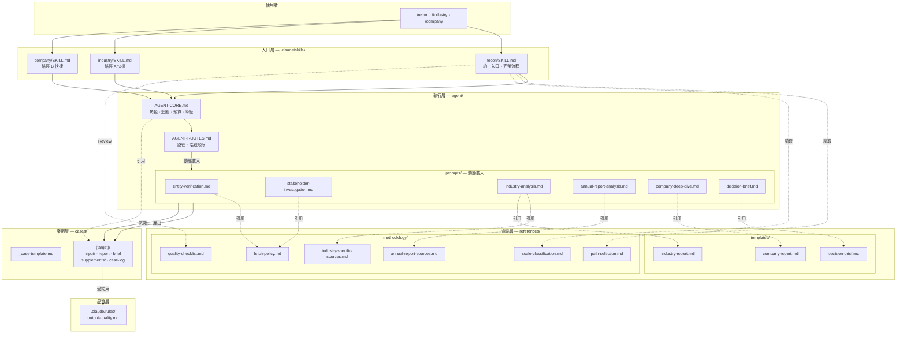
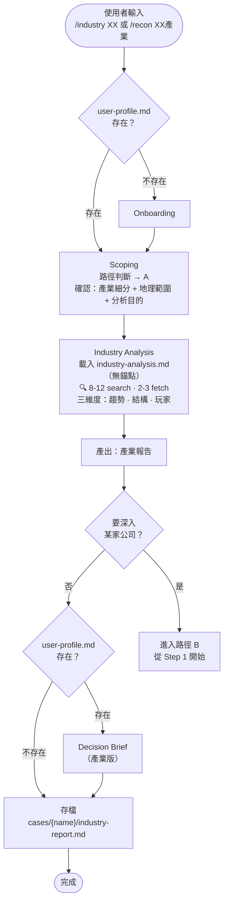
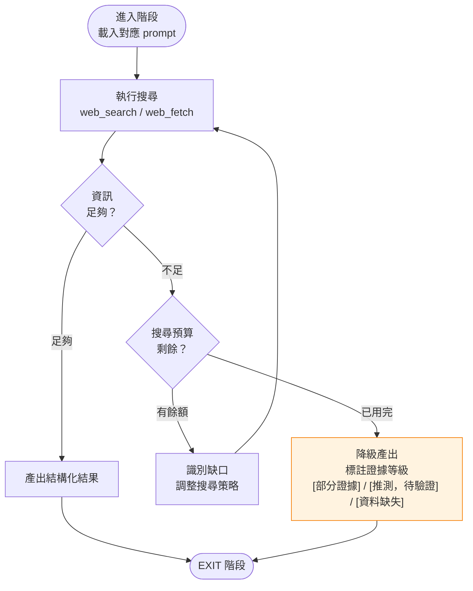
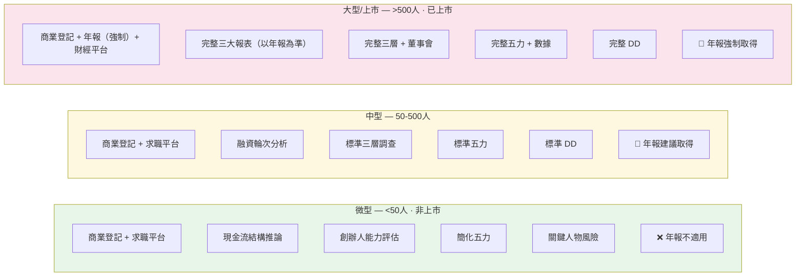
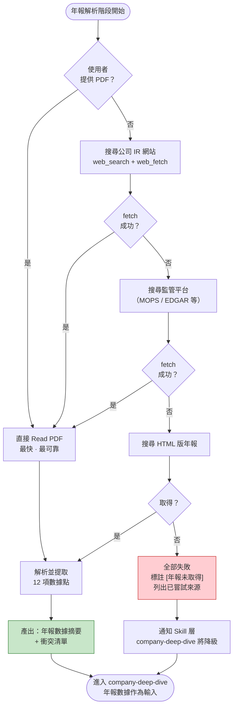

# Enterprise Tomb Raider — 系統流程圖

> 最後更新：2026-04-10（v1.5）
> 本文件使用 Mermaid 格式。在 GitHub 上可直接渲染，或使用 [Mermaid Live Editor](https://mermaid.live/) 檢視。

---

## 1. 系統總覽：三層架構 + 檔案調用關係

---

## 2. 路徑 B 完整流程：公司 → 產業（主要路徑）

```mermaid
flowchart TD
    START(["使用者輸入<br/>/company XX 或 /recon XX公司"]) --> PROFILE{"user-profile.md<br/>存在？"}

    PROFILE -->|"不存在"| ONBOARD["Onboarding<br/>建立使用者 Profile"]
    PROFILE -->|"存在"| SCOPING
    ONBOARD --> SCOPING

    SCOPING["Step 3: Scoping<br/>路徑判斷 → B<br/>讀取 path-selection.md<br/>讀取 scale-classification.md"] --> EV

    EV["Step 1: Entity Verification<br/>載入 entity-verification.md<br/>🔍 5-8 search · 1-2 fetch<br/>引用 fetch-policy.md"] --> EV_OUT["產出：快速輪廓<br/>規模分類確認"]

    EV_OUT --> ASSESS["Step 4.0.5: 預分析評估<br/>📊 零搜尋預算<br/>· 資料豐富度評估<br/>· 年報計畫（強制/建議/跳過）<br/>· 搜尋預算預估<br/>· 模型建議<br/>· 時間預估"]

    ASSESS --> USER_CONFIRM{"使用者確認？"}
    USER_CONFIRM -->|"繼續"| SI
    USER_CONFIRM -->|"提供 PDF 路徑"| SI
    USER_CONFIRM -->|"跳過年報"| SI

    SI["Step 1.5: Stakeholder Investigation<br/>載入 stakeholder-investigation.md<br/>🔍 10-15 search · 3-5 fetch<br/>引用 fetch-policy.md"] --> SI_OUT["產出：三項判斷<br/>權力結構 · 關係資本 · 人事穩定性"]

    SI_OUT --> IA["Step 2: Industry Analysis<br/>載入 industry-analysis.md（錨點模式）<br/>🔍 8-12 search · 2-3 fetch<br/>引用 industry-specific-sources.md"]

    IA --> AR_CHECK{"規模分類？"}

    AR_CHECK -->|"大型/上市<br/>（強制）"| AR
    AR_CHECK -->|"中型且公開<br/>（建議）"| AR
    AR_CHECK -->|"微型<br/>或已跳過"| CD

    AR["Step 2.5: Annual Report Analysis<br/>載入 annual-report-analysis.md<br/>🔍 5 search · 3 fetch<br/>引用 annual-report-sources.md<br/>📄 Read PDF（如使用者提供）"] --> AR_OUT["產出：年報數據摘要<br/>+ 衝突清單"]

    AR_OUT --> CD

    CD["Step 3: Company Deep Dive<br/>載入 company-deep-dive.md<br/>🔍 5-8 search · 2-3 fetch<br/>輸入：前序所有階段結果<br/>+ 年報數據（如有）<br/>引用 company-report.md 模板"] --> CD_CHECK{"有年報數據？<br/>（大型/上市）"}

    CD_CHECK -->|"有"| CD_FULL["正常分析<br/>年報為主要數據源"]
    CD_CHECK -->|"無"| CD_DEGRADE["降級分析<br/>6 維度標註<br/>⚠️ 報告 metadata 警告"]
    CD_CHECK -->|"不適用<br/>（微型/中型）"| CD_NORMAL["正常分析<br/>無年報前置檢查"]

    CD_FULL --> QR
    CD_DEGRADE --> QR
    CD_NORMAL --> QR

    QR["Step 5: Quality Review<br/>載入 quality-checklist.md<br/>24 項逐項檢查"] --> DB_CHECK{"user-profile.md<br/>存在？"}

    DB_CHECK -->|"存在"| DB["Step 5.5: Decision Brief<br/>載入 decision-brief.md<br/>🚫 零搜尋預算<br/>引用 decision-brief.md 模板<br/>角色化重新解讀"]
    DB_CHECK -->|"不存在"| SAVE

    DB --> SAVE["Step 6: 存檔 + 案例沉澱<br/>→ cases/{name}/company-report.md（含 Version History）<br/>→ cases/{name}/decision-brief.md<br/>→ cases/{name}/case-log.md"]

    SAVE --> SUPP_HINT(["完成<br/>★ 後續有新資料 →<br/>/supplement {name}"])

    style ASSESS fill:#e1f5fe,stroke:#0288d1,stroke-width:2px
    style AR fill:#e1f5fe,stroke:#0288d1,stroke-width:2px
    style CD_DEGRADE fill:#fff3e0,stroke:#f57c00,stroke-width:2px
```

---

## 3. 路徑 A 完整流程：產業 → 公司

---

## 4. 搜尋迴圈（每個 Agent 階段內部）

---

## 5. 規模自適應：不同規模走不同深度

---

## 6. 年報解析降級鏈

